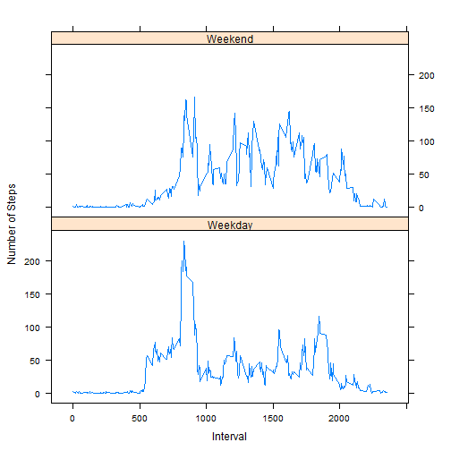

# Reproducible Research: Peer Assessment 1

Below is my submission for Peer Assessment 1. For the purposes of this assignment,
I assumed that you have the activity.csv dataset in your working directory.

## Loading and preprocessing the data


```r
stepsData <- read.csv("activity.csv", na.strings="NA")
```

## What is mean total number of steps taken per day?
For this question, I used the plyr package to split and summarize the data as
shown here:


```r
library(plyr)
sum_steps_by_day<-ddply(stepsData, .(date), summarize, totalSteps=sum(steps, na.rm=TRUE))
```

I then used the below code to produce a histogram of the total number of steps taken each day:

```r
hist(sum_steps_by_day$totalSteps, main="Histogram of Total Number of Steps Per Day", xlab="Ranges of Total Number of Steps Per Day", ylab="Number of Days")
```


Next, I used the below code to calculate and report the mean and median total number of steps taken per day


```r
mean(sum_steps_by_day$totalSteps)
```

```
## [1] 9354.23
```

```r
median(sum_steps_by_day$totalSteps)
```

```
## [1] 10395
```

## What is the average daily activity pattern?
To answer this question, I started by using the plyr package to find the number of steps at each time interval averaged across all days.
I then used the below code to make a time series plot (i.e. type = "l") of the 5-minute interval (x-axis) and the average number of steps taken, averaged across all days (y-axis).


```r
time_series_avg_steps<-ddply(stepsData, .(interval), summarize, meanSteps=mean(steps,na.rm=TRUE))
plot(time_series_avg_steps$interval, time_series_avg_steps$meanSteps, type="l", main="Average Steps Per Time Interval", xlab="Time Interval", ylab="Average Number of Steps")
```


Next, I used the below code to determine which 5-minute interval, on average across all the days in the dataset, contains the maximum number of steps:


```r
maxSteps<-max(time_series_avg_steps$meanSteps)
maxInterval<-subset(time_series_avg_steps, time_series_avg_steps$meanSteps==maxSteps)
print(maxInterval)
```

```
##     interval meanSteps
## 104      835  206.1698
```

## Imputing Missing Values
I used the below code to calculate and report the total number of missing values in the dataset.


```r
nullRows<-stepsData[is.na(stepsData[,"steps"]),]
countNulls<-nrow(nullRows)
print(countNulls)
```

```
## [1] 2304
```

Next, I used the below code to create a new dataset that was equivalent to the original. I then processed the dataframe with a for loop which checked for observations where the number of steps was NA, and replaced the NA values with the mean value for the corresponding time interval.


```r
stepsData2<-stepsData
for (i in 1:length(stepsData$steps)) {
  if (is.na(stepsData$steps[i])){
    replacement<-subset(time_series_avg_steps,interval==stepsData$interval[i])[,"meanSteps"]
    stepsData2$steps[i]<-replacement
  }
}
```

I then used the below code to make a histogram of the total number of steps taken each day.


```r
sum_steps_by_day_adj<-ddply(stepsData2, .(date), summarize, totalSteps=sum(steps, na.rm=TRUE))
hist(sum_steps_by_day_adj$totalSteps, main="Histogram of Total Number of Steps Per Day", xlab="Ranges of Total Number of Steps Per Day", ylab="Number of Days")
```


Next, I used the following code to calculate and report the mean and median total number of steps taken per day. These values differed from the estimates from the first part of the assignment. Both the mean and median had larger values than the original estimates, and the median and mean of the imputed dataset were equivalent, while the values were different when NA's were ignored.

```r
mean(sum_steps_by_day_adj$totalSteps)
```

```
## [1] 10766.19
```

```r
median(sum_steps_by_day_adj$totalSteps)
```

```
## [1] 10766.19
```

## Are there differences in activity patterns between weekdays and weekends?

In the below code, I add a column to the dataset with imputed values with the name "Weekday". I used a for loop to fill the column with either "Weekday" or "Weekend" based on the results of the weekdays function. 


```r
weekday<-rep(NA, length(stepsData2$steps))
stepsData2=cbind(stepsData2,weekday)
weekday_var=c("Monday", "Tuesday", "Wednesday", "Thursday", "Friday")
for (i in 1:length(stepsData2$steps)){
  dayOfWeek<-weekdays(as.Date(stepsData2$date[i], abbreviate=FALSE))
  if (dayOfWeek %in% weekday_var){
    stepsData2$weekday[i]<-"Weekday"
  } else {
    stepsData2$weekday[i]<-"Weekend"
  }
}
```

Next, I used the plyr package to calculate the average number of steps per time interval for weekdays vs weekends. I then recombined the two datasets, transformed the Weekday column into a factor variable, then used the lattice framework to plot the intervals vs the average number of steps for weekends and weekdays.


```r
stepsData2_weekdays<-subset(stepsData2,weekday=="Weekday")
stepsData2_weekends<-subset(stepsData2,weekday=="Weekend")
avg_weekday_steps<-ddply(stepsData2_weekdays, .(interval, weekday), summarize, avg_steps=mean(steps))
avg_weekend_steps<-ddply(stepsData2_weekends, .(interval, weekday), summarize, avg_steps=mean(steps))
combined_avg_steps<-rbind(avg_weekday_steps,avg_weekend_steps)
combined_avg_steps <- transform(combined_avg_steps, weekday=factor(weekday))
library(lattice)
xyplot(avg_steps ~ interval | weekday, data = combined_avg_steps, layout=c(1, 2), type="l", ylab="Number of Steps", xlab="Interval")
```


